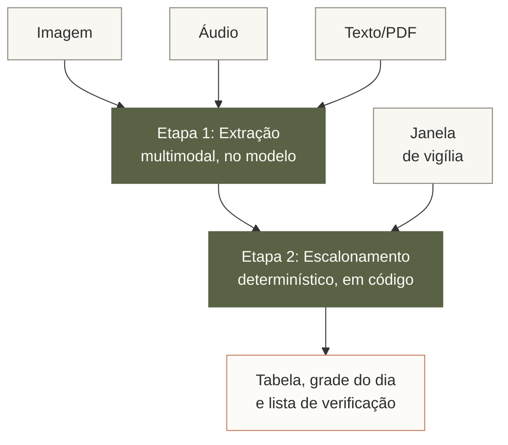
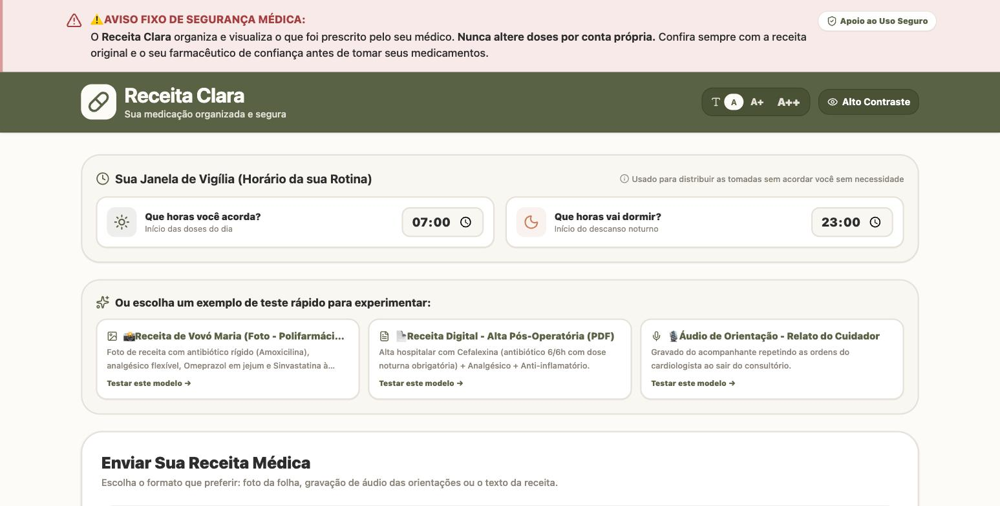
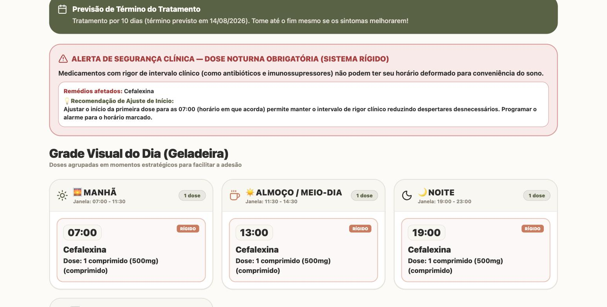
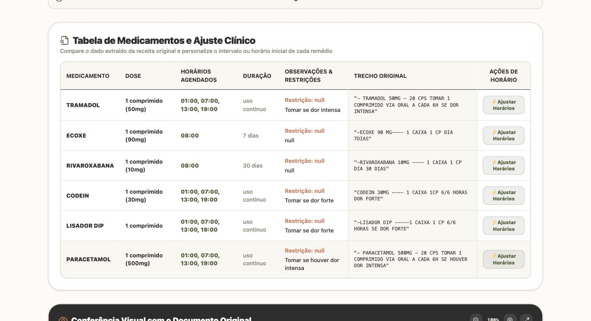
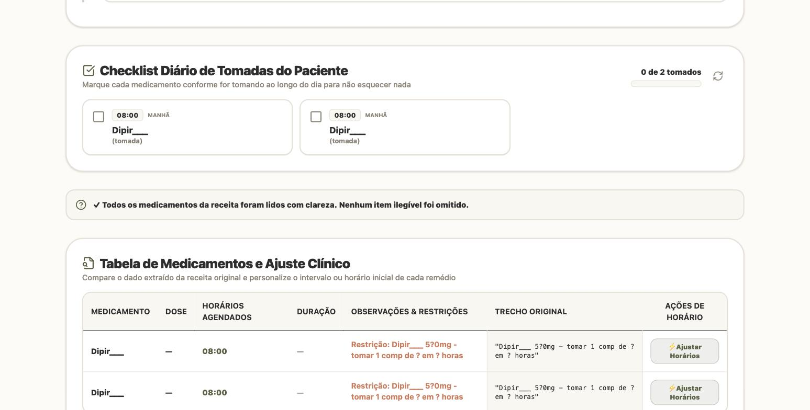

# Receita Clara: Documentação da Atividade

**Unidade de Aprendizagem:** Sistemas Interativos e de Visualização
**Professor:** Edson Moacir Ahlert
**Estudantes:** Kauan Calheiro e Everton Luiz de Oliveira
**Data:** 03/08/2026

---

## 1. Descrição da aplicação

**Problema.** O paciente sai do consultório com uma receita frequentemente
ilegível e uma posologia que interpreta errado. A não-adesão ao tratamento por
confusão de horário é uma das principais causas de falha terapêutica, e atinge
sobretudo idosos e pacientes em polifarmácia.

**Público-alvo.** Pacientes idosos, cuidadores familiares e pessoas em uso
simultâneo de cinco ou mais medicamentos.

**Objetivo.** Transformar uma receita médica, em qualquer formato de entrada,
numa grade de horários clara, visual e imprimível, resolvendo inclusive a
dúvida prática mais comum: *"de 8 em 8 horas a partir de quando?"*.

**Justificativa do uso de IA multimodal.** A mesma informação chega ao paciente
por canais distintos: foto da receita impressa, foto de receita manuscrita,
receita digital em PDF ou o relato falado do que o médico orientou. Nenhuma
solução baseada apenas em texto cobre esse conjunto. A leitura de manuscrito e
a transcrição de áudio são requisitos do problema, não enfeites.

---

## 2. Projeto da solução

**Modalidades de entrada:** imagem (foto de receita impressa ou manuscrita),
áudio (relato do paciente ou cuidador) e texto/PDF (receita digital). Além dos
arquivos, o usuário informa sua janela de vigília, ou seja, a hora em que
acorda e a hora em que dorme.

**Fluxo de utilização:**



**Funcionalidades principais.** A extração recupera nome, dose, forma,
frequência, duração e restrições de cada medicamento. O escalonador distribui
as doses dentro da janela de vigília, classificando o espaçamento como
**rígido** (antibióticos e imunossupressores, cujo intervalo é clínico) ou
**flexível** (analgésicos, vitaminas); quando um medicamento rígido exige dose
de madrugada, o sistema mantém o horário correto e alerta para programar
alarme, em vez de distorcer o intervalo por conveniência. Completam a solução o
agrupamento de doses compatíveis no mesmo horário, o cálculo da data de término
do tratamento, recursos de acessibilidade (escala de fonte, alto contraste,
leitura em voz alta, layout de impressão) e a exibição do trecho original ao
lado de cada dado extraído.

**Saídas esperadas:** tabela de medicamentos, grade visual do dia em cinco
blocos (manhã, almoço, tarde, noite e madrugada), agenda cronológica, checklist
diário e lista de itens a confirmar com o farmacêutico.

**Política de segurança.** A aplicação transcreve e organiza o que foi
prescrito. Nunca altera dose nem sugere ou substitui medicamento. Itens
ilegíveis retornam nulos e vão para a lista de verificação, jamais para um
palpite.

---

## 3. Desenvolvimento da aplicação

Desenvolvida no **Google AI Studio** em 5 iterações, no dia 03/08/2026.

**Link de acesso:**
https://ais-pre-nizmanjhthj6g62us4ybqk-146221727290.us-west1.run.app

**Decisão de projeto central:** a extração multimodal ficou no modelo, mas o
cálculo dos horários foi implementado como código determinístico
(`scheduler.ts`), não como instrução no prompt. Num domínio em que errar tem
consequência física, aritmética de intervalos não deve depender de inferência
probabilística.

**Modelos utilizados:** `gemini-3.6-flash` nas iterações 1 a 4. A partir da
iteração 5 o backend foi configurado para usar prioritariamente o
`gemini-3.1-pro-preview`, com fallback automático para o modelo mais econômico.
Na prática, os limites de cota fizeram o fallback ser acionado, de modo que
**os testes documentados na seção 5 foram executados no modelo mais barato, não
no Pro**. Esse detalhe operacional acabou se revelando a evidência central da
análise crítica.

---

## 4. Prompts utilizados

### Prompt inicial

Estruturado em duas etapas explícitas, com regras de segurança marcadas como
inegociáveis. Gerou 18 arquivos em 238 segundos, com aplicação funcional.

```
Crie um app web chamado "Receita Clara".

O usuário envia uma receita médica como imagem (foto, impressa ou manuscrita),
áudio (relato das orientações) ou texto/PDF, e informa a hora que acorda e a
hora que dorme.

ETAPA 1 — Extração. Para cada medicamento identificado, extraia:
  nome, dose_por_tomada, forma (comprimido/gota/ml), frequencia,
  duracao_tratamento, restricoes (jejum / com alimento / antes de dormir /
  outras), observacoes, trecho_original, legibilidade (alta/media/baixa)

ETAPA 2 — Escalonamento. Gere os horários de cada dose considerando:
  - Distribuir dentro da janela de vigília informada.
  - Classificar o espaçamento como RÍGIDO (antibióticos, anticonvulsivantes,
    imunossupressores — o intervalo é clínico) ou FLEXÍVEL (analgésicos "se
    dor", vitaminas, sintomáticos).
  - Se um medicamento RÍGIDO exigir dose na madrugada, MANTENHA o horário
    correto e avise explicitamente, sugerindo o início de dia que minimiza o
    incômodo. Não distorça o intervalo clínico por conveniência.
  - Agrupar doses compatíveis no mesmo horário para reduzir alarmes.
  - Sinalizar conflitos entre restrições (ex.: jejum vs. com alimento no mesmo
    horário) e separá-los.

REGRAS INEGOCIÁVEIS:
  - NUNCA invente ou infira dose, nome de medicamento ou frequência. Se estiver
    ilegível ou ambíguo, retorne null e liste em "itens_para_confirmar".
  - NÃO sugira, substitua nem remova medicamentos. Você organiza o que foi
    prescrito, não prescreve.
  - Sempre exiba o trecho original ao lado do dado extraído.

SAÍDA na interface:
  1. Tabela: medicamento | dose | horários | duração | observação | confiança
  2. Grade visual do dia em blocos (manhã, almoço, tarde, noite),
     fonte grande, alto contraste, otimizada para impressão.
  3. Lista "Confirme com o farmacêutico" com os itens ilegíveis.
  4. Aviso fixo: "Confira sempre com a receita original e seu farmacêutico."

Português do Brasil. Interface acessível para idosos: fonte grande, botões
grandes, sem jargão.
```

### Iterações

| # | Prompt | Objetivo | Resultado |
|---|---|---|---|
| 2 | `Apply the "Natural Tones" design theme to the app.` | Legibilidade e conforto visual para o público idoso | Paleta aplicada (`#FDFBF7`, `#5A6246`, `#C97D60`, `#A53F3F`). 102s |
| 3 | *"um remédio de 6/6 horas está como '8 horas', precisamos de mecanismos para isso e ter toda a agenda de tomar os remédios"* | Corrigir erro de frequência e dar controle sobre os horários | Novo parser em `scheduler.ts`, modal de ajuste e agenda cronológica. 16 arquivos, 338s |
| 4 | *"olhe os logs tivemos erros"* | Corrigir defeitos de integração | Modal não abria; estado de doses dessincronizado entre agenda e checklist. 2 arquivos, 56s |
| 5 | *"conseguimos usar um modelo mais capaz ou revisar o system prompt? o de 6 em 6 horas não está sendo respeitado"* + foto de receita | Atacar a reincidência do erro por duas frentes: modelo e especificação | Configuração do `gemini-3.1-pro-preview` como primário **e** regra exigindo o campo numérico `frequencia_horas`. Por cota, o fallback é que atendeu. 2 arquivos, 143s |

---

## 5. Testes realizados

Executados em 03/08/2026, janela de vigília 07:00 às 23:00, na versão
publicada.



### Teste 1: baseline com dois medicamentos (texto)

**Entrada:** `Amoxicilina 500mg de 8 em 8 horas por 7 dias. Losartana 50mg pela
manhã, uso contínuo.`

**Resultado:** a Amoxicilina foi agendada corretamente às 07:00, 15:00 e 23:00,
com classificação rígida e alerta de dose noturna. A **Losartana foi
inteiramente omitida**, não aparecendo na tabela, na grade nem no checklist,
embora conste na transcrição bruta exibida pelo próprio app. Dose e duração
ficaram vazias.

**Análise:** omissão silenciosa de medicamento é a falha mais grave possível
neste domínio, pois o paciente imprimiria a grade e não tomaria o
anti-hipertensivo. Agrava-se pelo fato de a aplicação exibir, na mesma tela, a
mensagem "Todos os medicamentos da receita foram lidos com clareza".

### Teste 2: regressão do intervalo de 6 em 6 horas (texto)

**Entrada:** `Cefalexina 500mg de 6 em 6 horas por 10 dias.`

**Resultado:** correto. Quatro tomadas em intervalo exato de 6 horas (01:00,
07:00, 13:00 e 19:00), dose e duração extraídas, data de término calculada
(14/08/2026) e alerta aplicado à tomada de madrugada.

**Análise:** confirma que a correção da iteração 5 resolveu o defeito central
do desenvolvimento. Com um único medicamento, o fluxo funciona ponta a ponta
como especificado.



### Teste 3: polifarmácia com restrições conflitantes (texto)

**Entrada:** 6 medicamentos, sendo Omeprazol (jejum), Amoxicilina (8/8h),
Metformina (após almoço e jantar), Sinvastatina (antes de dormir), Losartana
(manhã) e Dipirona (6/6h se houver dor).

**Resultado:** os 6 foram extraídos com doses corretas e as frequências rígidas
saíram certas. Porém a Metformina, prescrita "após o almoço e após o jantar",
foi agendada para 08:00 e 22:00; o conflito entre Omeprazol em jejum às 07:00 e
Metformina com alimento às 08:00 não foi sinalizado; e a Dipirona condicional
recebeu quatro doses fixas, incluindo 01:00.

**Análise:** o modelo leu bem, e o que falhou foi o uso do que ele leu. Todas
as restrições aparecem corretamente extraídas na coluna de observações, mas
nenhuma influencia o horário calculado. O `null` devolvido para campos ausentes
chega à tela como texto literal em vez de acionar a verificação. A extração
multimodal escala bem para seis itens simultâneos; o aproveitamento dessa
extração não escala junto.

### Teste 4: receita manuscrita real (imagem)

**Entrada:** fotografia de receita hospitalar manuscrita com 6 medicamentos.
Por conter dados pessoais do paciente e da médica, a imagem foi recortada antes
do envio, preservando apenas o bloco da prescrição.

**Resultado:** a extração foi integralmente fiel ao documento, com todas as
dosagens e durações corretas. Já o escalonamento converteu os quatro
analgésicos prescritos **conforme necessidade** (Tramadol, Codeína, Lisador DIP
e Paracetamol, todos "a cada 6h se dor intensa/forte") em doses fixas
obrigatórias quatro vezes ao dia, agendando **os quatro simultaneamente às
01:00 da madrugada**. A agenda final tem 18 tomadas diárias para uma receita
cujo regime fixo real são 2 comprimidos por dia.

**Análise:** o OCR de manuscrito, apontado como o ponto mais frágil previsto,
foi o componente que melhor funcionou. O erro de agendamento **foi
especificado por nós e não é desvio do modelo**: a iteração 5 pediu que o
padrão de 6 em 6 horas fosse respeitado, e a resposta registrada já antecipava
"07:00, 13:00, 19:00 e 01:00 da madrugada com alerta de descanso". A regra
nasceu de um caso legítimo, o antibiótico cujo intervalo é clínico, mas foi
redigida sem exceção para medicação condicional, passando a tratar "a cada 6h"
(posologia) e "a cada 6h se dor" (frequência máxima) como equivalentes.
Corrigiu a Cefalexina e quebrou o Tramadol.



*A coluna do trecho original comprova que o OCR leu "SE DOR INTENSA", e a
coluna de observações registra a condicionalidade, mas os horários agendados
são fixos.*

### Teste 5: teste negativo com receita ilegível (texto)

**Entrada:** transcrição simulando manuscrito ilegível: `"Dipir___ 5?0mg, tomar
1 comp de ? em ? horas"`, com segunda linha borrada e terceira rasurada.

**Resultado:** o modelo **não inventou** dose nem nome, mantendo `Dipir___`
literal e o campo de dose vazio. Porém a aplicação **agendou o item mesmo
assim**, criando duas tomadas às 08:00, não exibiu a lista "Confirme com o
Farmacêutico", perdeu as duas linhas seguintes sem aviso e exibiu "Todos os
medicamentos da receita foram lidos com clareza".

**Análise:** a política de "nunca chutar" foi obedecida na parte negativa e
violada na parte positiva. O resultado é pior que um palpite explícito: o
sistema produz uma grade aparentemente válida para um medicamento que não
conseguiu identificar, e afirma completude. O usuário perde justamente o sinal
que o levaria a conferir com o farmacêutico.



---

## 6. Análise crítica

### Prompt pesou mais que modelo

O erro de leitura de frequência, com "6 em 6 horas" interpretado como intervalo
de 8 horas, foi o problema mais persistente do desenvolvimento. A hipótese
inicial foi de insuficiência do modelo, e a ação da iteração 5 foi dupla:
promover `gemini-3.6-flash` para `gemini-3.1-pro-preview` **e** endurecer o
system prompt, exigindo o retorno obrigatório de um campo numérico
`frequencia_horas` em vez de depender da frase em linguagem natural.

A separação entre as duas causas veio de um acidente útil. Os limites de cota
impediram o uso efetivo do Pro, e **todos os testes da seção 5 acabaram sendo
executados no modelo mais barato**, o mesmo que vinha errando antes da mudança
de prompt. Ainda assim, o intervalo de 6 em 6 horas passou a sair correto e de
forma consistente.

Isso isola a variável: se a capacidade do modelo fosse a causa, voltar ao
modelo econômico teria reintroduzido o erro. Não reintroduziu. O gargalo era a
ambiguidade da especificação de saída, não a capacidade de raciocínio. Das duas
intervenções feitas simultaneamente, a que resolveu foi a de custo zero, e a
troca de modelo, além de mais cara, teria mascarado a causa real caso tivesse
funcionado.

### Dois padrões observados

**A regra que proíbe é cumprida; a que exige uma ação, não.** O modelo nunca
inventou dose, nome ou frequência. Já as instruções que pediam ação
compensatória, como listar itens em "itens_para_confirmar", falharam de forma
reiterada. A explicação está na estrutura da saída: `frequencia_horas` é
numérico e obrigatório, de modo que o código percebe se vier vazio, enquanto
uma lista que pode legitimamente vir vazia é indistinguível de "nada a
confirmar".

**Uma instrução acertada num caso não é acertada em geral.** A mesma regra que
resolveu o 6/6h produziu, no teste 4, quatro analgésicos condicionais agendados
como doses obrigatórias de madrugada. Ampliar a precisão de uma regra é também
ampliar seu alcance, e a regressão aparece longe do ponto em que se corrigiu.

Some-se a isso a separação entre percepção e uso. A informação necessária
esteve sempre disponível: a condicionalidade e as restrições alimentares foram
corretamente extraídas e exibidas. Faltou ao escalonador consultá-las, porque
não foi instruído a isso.

### Limitações

- **Omissão silenciosa de medicamentos** (teste 1) e **afirmação falsa de
  completude** (testes 1 e 5), exibida incondicionalmente mesmo com itens
  ilegíveis na tela.
- **Agendamento de itens não compreendidos** (teste 5), em vez de bloqueio.
- **Uso condicional não é modelado** (testes 3 e 4). É a falha de maior
  potencial de dano, e decorre da abrangência da regra de 6/6h.
- **Restrições alimentares não afetam o cálculo do horário**, embora sejam
  corretamente extraídas.
- **Ausência de validação farmacológica.** O sistema não detecta prescrição
  incorreta, apenas reproduz o que leu.
- **A modalidade de áudio não foi validada** por um defeito de upload da
  aplicação, alheio ao comportamento do modelo. As conclusões deste trabalho se
  restringem às modalidades de texto e imagem.

### Oportunidades de melhoria

1. **Modelar o uso condicional** com um campo booleano `se_necessario`, que
   retira o medicamento da grade fixa e o apresenta como "tomar se precisar,
   respeitando intervalo mínimo".
2. **Condicionar o aviso de completude ao estado real**, exigindo
   `legibilidade_global` e `itens_para_confirmar` obrigatórios, aplicando a
   técnica que resolveu o `frequencia_horas`.
3. **Conferir a contagem** de medicamentos da transcrição bruta contra os itens
   estruturados, alertando na divergência.
4. **Bloquear o agendamento** de itens sem dose ou frequência.
5. **Levar as restrições alimentares ao escalonador** como enum de janela, em
   vez de texto livre.
6. **Validação cruzada do nome contra a base da ANVISA**, para detectar erro de
   OCR com consequência grave.
