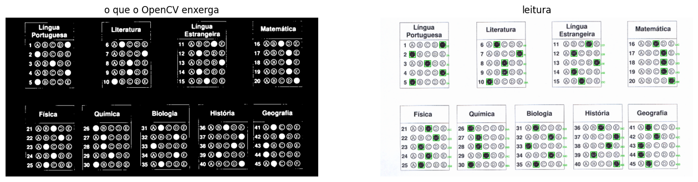

# Experimentação com Visão Computacional
### Leitura automática de cartão-resposta com OpenCV

**Curso:** Engenharia de Software · **UA:** Sistemas Interativos e de Visualização
**Estudante:** Kauan Morinel Calheiro · **Professor:** Edson Moacir Ahlert

---

## 1. O problema

Escolhi fazer um programa que **lê as respostas de um cartão de prova sozinho**.

- **O que detectar:** qual bolha está pintada em cada questão.
- **Tecnologia:** OpenCV. Sem IA e sem treinar nada, só regras de geometria e contagem de pixels.
- **Entrada:** cartões-resposta escaneados. Usei dois tipos: quatro folhas que eu mesmo gerei, que já sabia as respostas, e dois cartões reais de um processo seletivo, com 45 questões divididas em 9 blocos.
- **Saída esperada:** a lista das respostas (`1E 2A 3C ...`) e a imagem mostrando o que o programa entendeu.

Escolhi esse tema porque é um problema que eu já sabia que existe na vida real e que dá pra conferir se está certo ou não. Se o programa lê `1E` e na folha está marcado E, acertou.

## 2. Como funciona

O código faz cinco coisas:

1. **Deixa a imagem em preto e branco.** Converte pra cinza, borra um pouco pra tirar o granulado do scanner e usa a limiarização de Otsu, que escolhe sozinho o valor que separa escuro de claro.
2. **Acha as bolhas.** Pega os contornos e fica só com os que são redondos (largura mais ou menos igual à altura) e grandes o bastante. Isso já joga fora o texto, os números e as bordas dos blocos.
3. **Monta as linhas.** Bolhas que estão na mesma altura viram uma linha.
4. **Separa os blocos.** Na folha real tem vários blocos um do lado do outro, então uma linha da imagem tem as questões 1, 6, 11 e 16 juntas. O código corta a linha onde o espaço em branco é bem maior que o normal.
5. **Mede o preenchimento.** Pra cada bolha ele calcula quantos por cento estão pintados. A mais cheia é a resposta.

Fora a letra, ele também pode responder `?`, quando nenhuma bolha passou do mínimo, e `*`, quando duas passaram. Achei melhor ele avisar do que chutar.


*Do lado esquerdo o que o OpenCV enxerga de verdade, que é essa máscara preto e branco. Do lado direito a leitura, com cada questão marcada em verde.*

## 3. Testes

| # | Imagem | O que tinha nela | Resultado |
|---|---|---|---|
| 1 | folha gerada, limpa | 10 questões, tudo bem marcado | leu as 10 certas |
| 2 | folha gerada, torta | mesma folha, mas em ângulo, tipo foto de celular | leu as 10 certas |
| 3 | folha gerada | uma marca fraca, mal pintada | respondeu `?` na questão 5, não chutou |
| 4 | folha gerada | duas alternativas marcadas na mesma questão | respondeu `*` na questão 7 |
| 5 | cartão real escaneado | 45 questões, 9 blocos | leu as 45 certas |
| 6 | outro cartão real | mesmo formato, respostas diferentes | leu as 45 certas |

Essa foi a saída do teste 6:

```
1E 2A 3C 4E 5A 6B 7E 8C 9C 10A 11D 12B 13E 14B 15C 16C 17D 18D 19D 20E
21C 22D 23B 24C 25B 26A 27B 28B 29C 30A 31B 32D 33A 34D 35B 36C 37E
38D 39B 40E 41B 42C 43A 44A 45B
```

Conferi questão por questão na imagem e bateu.

## 4. O que deu errado no meio do caminho

Nas folhas que eu mesmo desenhei funcionou de primeira, e eu achei que estava pronto. Aí testei nos cartões reais e apareceram dois problemas que eu nunca teria imaginado sozinho.

**A bolha vazia não é vazia.** Na folha impressa, a bolha vem com o círculo desenhado e a letra dentro. Quando eu media a bolha inteira, uma bolha vazia dava 62% de preenchimento e uma marcada dava 100%. Não tem número de corte que separe isso direito. O que resolveu foi medir só os 60% do meio da bolha, ignorando a borda e a letra. Aí vazia dá quase 0 e marcada dá quase 1.

**Os blocos lado a lado.** Como falei no passo 4, isso bagunça a ideia de linha. Tive que fazer o programa cortar a linha nos espaços grandes.

Os dois problemas só apareceram no material real, e foi a parte que mais me fez entender o assunto.

Outras limitações que continuam:

- precisa de papel plano e luz parecida na folha toda, porque sombra ou papel amassado atrapalham a limiarização;
- marca de lápis muito clara vira `?`;
- o formato da folha está meio que embutido no código (blocos de 5 alternativas contados da esquerda pra direita). Se a folha for de outro jeito, tem que mexer no agrupamento;
- os três parâmetros (tamanho mínimo da bolha, tamanho do miolo e % de preenchimento) tiveram que ser ajustados. O valor que funcionava nas minhas folhas não funcionava no scan real.

## 5. Comparação com IA multimodal

Usei o **Gemini** pela API, na mesma imagem do teste 6 (`teste_6_scan_real.png`, o cartão real de 45 questões), tendo a leitura do OpenCV como referência. Escolhi o **gemini-3.5-flash-lite** por causa do custo: é o que roda na camada gratuita da API do Google, então o teste saiu de graça. Seria o mesmo critério num sistema real, porque correção de prova é trabalho em volume e é o custo por imagem que decide.

Testei dois prompts, duas rodadas cada.

**Prompt simples:** "Esta é uma folha de respostas. Para cada questão, diga qual alternativa está marcada. Responda apenas a lista, no formato `1-B`."

**Prompt detalhado:** reparei que cada bolha tem a letra impressa dentro, e que ao pintar a bolha a letra some. Então em vez de pedir a bolha pintada, pedi a letra que sumiu: *"em cada questão você deve conseguir ler 4 letras e ver uma bolha escura sem letra legível; identifique qual das cinco está faltando"*, mais a explicação do formato da folha e do formato da resposta.

| Prompt | Rodada 1 | Rodada 2 | As duas rodadas entre si |
|---|---|---|---|
| simples | 40 de 45 (88,9%) | 41 de 45 (91,1%) | 42 de 45 (93,3%) |
| detalhado | 44 de 45 (97,8%) | 44 de 45 (97,8%) | 45 de 45 (100%) |

O OpenCV, pra comparar, fez 45 de 45 e repete o resultado sempre.

O que dá pra tirar disso:

- **O prompt pesou quase 8 pontos**, sem trocar modelo nem imagem. Com o prompt vago as duas rodadas discordavam em 3 questões; com o detalhado saíram idênticas, letra por letra.
- **A conta em cima da folha:** 90% dá umas 4 ou 5 questões erradas por prova, e 97,8% dá cerca de 1.
- **Os erros são de posição.** Todos caíram numa coluna vizinha: respondeu D onde era E, C onde era D. Ele vê que tem bolha pintada, mas se confunde em qual coluna ela está.
- **Sobrou um erro fixo, a questão 35.** Nas duas rodadas do prompt detalhado ele respondeu C, e está marcado B. Ampliei a imagem pra conferir: o OpenCV está certo.
- **Nunca sinalizou dúvida.** Em todas as rodadas devolveu uma letra pras 45 questões, inclusive nas erradas. O meu código, quando não tem certeza, devolve `?` ou `*`.
- **A melhora tem um preço.** Se uma frase muda o resultado de 88,9% pra 97,8%, a qualidade da correção passa a depender de um texto que ninguém revisa nem versiona. No código são três números que eu sei o que fazem e posso testar.

Detalhe prático: algumas chamadas voltaram com erro 503 do servidor e tive que repetir. O código roda mesmo sem internet.

## 6. Comparando as duas abordagens

**Precisão.** O OpenCV leu 45 de 45. O Gemini ficou em 88,9% com o prompt simples e chegou a 97,8% com o prompt detalhado. O código ganha, mas por pouco, e só ganha porque eu ajustei ele pra essa folha.

**Qual é mais previsível.** O OpenCV, por construção: mesma entrada, mesma saída, sempre. O Gemini mudou de resposta em 3 questões entre duas rodadas com o prompt simples, e repetiu exatamente a mesma resposta com o prompt detalhado. Ou seja, ele pode ser estável, mas isso não está garantido por nada, depende de como eu pedi.

**Dá pra saber por que errou?** No OpenCV dá. É abrir a máscara e ver que a bolha não passou do corte ou que o contorno nem foi detectado. No Gemini não dá. Eu consigo ver o padrão, que é errar a coluna vizinha, mas não consigo consertar direito. O que eu fiz foi mexer no prompt até melhorar, que funcionou, mas é tentativa e erro: eu não sei por que a questão 35 continua errada.

**Trabalho pra fazer funcionar.** Aqui o Gemini ganha fácil. Eu precisei descobrir os dois problemas da seção 4 e ajustar três parâmetros. Ele só precisou da imagem e de uma frase, e nem sabia que aquela folha existia.

**Saber que não sabe.** O meu código responde `?` e `*` porque eu programei pra isso. O Gemini respondeu uma letra pras 45 questões nas duas rodadas, inclusive nas erradas. Uma resposta errada com cara de certa é pior que um "não sei", porque ninguém vai conferir.

**Custo, velocidade e privacidade.** O OpenCV lê as 45 questões em menos de um segundo, de graça, sem a imagem sair do computador. No Gemini eu não paguei nada porque a camada gratuita cobre uma quantidade limitada de chamadas por dia, mas isso só funciona no tamanho do meu teste. Numa prova de mil candidatos são mil chamadas, o limite gratuito estoura e passa a ser cobrado por imagem. Fora que são mil documentos de candidato saindo pra um servidor de terceiros, e uma dependência de um serviço que já me deu 503 no meio do teste.

## 7. E se fosse um sistema real?

Eu usaria os dois, mas com papéis bem diferentes.

O **OpenCV** faria a leitura de todas as folhas. Correção de prova é um problema fechado: a folha é sempre a mesma, quem corrige é quem imprime e o volume é alto. Nesse cenário eu quero uma coisa que rode local, de graça, na mesma velocidade pra mil folhas, sempre com o mesmo resultado e que eu consiga explicar quando erra. Um sistema que dá nota diferente na segunda correção, como aconteceu no teste, é recurso de candidato na certa.

O **modelo multimodal** entraria só nas folhas que o código marcou como `?` ou `*`. São poucas, o custo fica baixo, e é exatamente onde o código admite que não tem certeza. Também usaria ele pra testar o sistema, mandando folhas de formatos diferentes pra ver se o meu código aguentaria.

O resultado do modelo é ok, mas não é confiável o suficiente pra corrigir sozinho. Com o prompt detalhado ele ficou em 97,8%, que dá mais ou menos uma questão errada por folha. O problema não é a porcentagem: é que eu não sei quais questões ele errou. Isso obriga a conferir todas na mão, e aí a automação perde o sentido.
