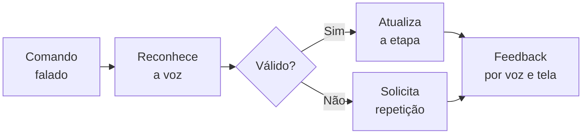

# Explorando Técnicas Não Convencionais de Interação

**Estudantes:** Kauan Morinel Calheiro e Everton Luiz de Oliveira

## Técnicas investigadas

O trabalho investigou duas técnicas que usam a voz como parte central da interação.

| Técnica                     | Entrada, processamento e saída                                                                                                                                              | Contexto e usuários                                                                                                                                                                                      |
| --------------------------- | --------------------------------------------------------------------------------------------------------------------------------------------------------------------------- | -------------------------------------------------------------------------------------------------------------------------------------------------------------------------------------------------------- |
| **Interface por voz (VUI)** | O microfone capta a fala; o sistema a converte em texto, identifica a intenção e responde por áudio ou tela.                                                                | Assistentes virtuais, dispositivos inteligentes e acessibilidade. Atende qualquer usuário, mas é especialmente útil para pessoas com deficiência visual ou motora e para quem está com as mãos ocupadas. |
| **Voz, olhar e gestos**     | Microfone, câmeras e sensores captam fala, direção do olhar e movimentos; o sistema sincroniza os sinais para identificar o objeto e responde por áudio ou destaque visual. | Realidade aumentada, treinamentos e orientação de tarefas práticas. Pode ser utilizada por estudantes, técnicos e profissionais que precisam consultar informações mantendo as mãos livres.              |

### Aplicações pesquisadas

| Aplicação | Uso da técnica |
|---|---|
| **Android Voice Access** | Recurso de acessibilidade que permite abrir aplicativos, navegar pelas telas, selecionar elementos e editar textos por comandos falados. A interface mostra o que reconheceu e pode numerar itens quando um comando for ambíguo. |
| **Amazon Echo Show** | Dispositivo com Alexa que combina uma experiência orientada por voz com tela e toque. As respostas visuais complementam a fala com textos, imagens, listas e controles. |
| **GazePointAR** | Protótipo de realidade aumentada que combina voz e direção do olhar para interpretar referências como “isso” ou “aquilo” e identificar o objeto observado. |
| **Microsoft SIGMA** | Sistema experimental de realidade mista para orientar tarefas físicas. Utiliza fala, visão computacional, mãos e olhar para acompanhar o contexto e apresentar instruções. |

### Benefícios, limitações e condições de uso

A voz permite interagir com as mãos livres, enquanto olhar e gestos ajudam a identificar objetos de forma natural. Ruídos, falhas de reconhecimento ou dos sensores podem gerar ações incorretas, e a solução multimodal exige maior custo e processamento. O uso requer feedback claro, confirmação de ações, proteção dos dados e alternativas por texto ou botões.

## Análise com as heurísticas de Nielsen

### Interface por voz

| Heurística | Análise |
|---|---|
| **Visibilidade do estado do sistema** | Um ícone ou sinal sonoro deve informar quando o sistema está ouvindo e processando. |
| **Reconhecimento em vez de memorização** | Sugestões como “diga: iniciar checklist” evitam que o usuário precise decorar comandos. |
| **Prevenção de erros** | Ações importantes devem ser confirmadas antes de serem executadas. |

Essa técnica resolve a dificuldade de usar uma tela com as mãos ocupadas, mas pode introduzir outro problema: executar uma ação diferente porque a fala foi reconhecida incorretamente.

### Voz, olhar e gestos

| Heurística | Análise |
|---|---|
| **Correspondência com o mundo real** | Falar e apontar se aproxima da forma como as pessoas se comunicam entre si. |
| **Visibilidade do estado do sistema** | O objeto identificado deve ser destacado antes da execução do comando. |
| **Controle e liberdade do usuário** | O usuário precisa conseguir cancelar ou desfazer uma seleção incorreta. |

A técnica acrescenta contexto aos assistentes de voz, mas pode interpretar um olhar casual como uma intenção de selecionar um objeto.

## Oportunidade de projeto

Foi escolhida a **interface por voz** para desenvolver o **VozSegura**, um checklist falado para procedimentos em laboratórios e oficinas.

Nesses ambientes, estudantes e profissionais podem estar usando luvas ou segurando ferramentas. Consultar uma tela interrompe a atividade, enquanto esquecer uma etapa pode provocar erros ou acidentes. A voz permite acompanhar as instruções com as mãos livres e a atenção voltada à tarefa.

O VozSegura apresentará uma etapa por vez e aceitará cinco comandos principais: **iniciar**, **concluído**, **repetir**, **voltar** e **cancelar**. O objetivo é reduzir etapas esquecidas e tornar o procedimento mais seguro. A ferramenta será apenas um apoio e não substituirá as normas da instituição nem a supervisão responsável.

## Conceito do protótipo

O protótipo terá um checklist curto cadastrado pelo responsável do local. A etapa atual será lida em voz alta e também exibida na tela. Quando o usuário disser “concluído”, o sistema confirmará o comando e avançará. Ao final, será mostrado um resumo do procedimento.

### Fluxo da interação



### Entrada, processamento e saída

- **Entrada:** comandos falados e botões como alternativa acessível.
- **Processamento:** conversão da fala em texto, identificação do comando e controle da etapa atual.
- **Saída:** leitura da instrução, texto, progresso e mensagens de confirmação ou erro.

Comandos duvidosos não serão executados. O sistema pedirá que o usuário repita a fala, evitando avançar por engano.

### Tecnologias

O protótipo poderá ser desenvolvido com HTML, CSS e JavaScript. A [Web Speech API](https://developer.mozilla.org/en-US/docs/Web/API/Web_Speech_API) poderá realizar o reconhecimento e a síntese de voz. As etapas ficarão em um arquivo JSON e o progresso poderá ser salvo no navegador. Essa primeira versão não precisará de inteligência artificial.

### Esboço da interface

```text
┌─────────────────────────────────────────┐
│ VOZSEGURA                 ● Ouvindo     │
├─────────────────────────────────────────┤
│ Checklist: Preparação do equipamento    │
│ Etapa 2 de 5              ████░░░░ 40%  │
│                                         │
│ “Verifique a área antes de continuar.”  │
│                                         │
│ Comando ouvido: “concluído”             │
│                                         │
│ [Repetir]  [Voltar]  [Concluir etapa]   │
├─────────────────────────────────────────┤
│ Diga: concluído, repetir ou cancelar    │
└─────────────────────────────────────────┘
```

## Conclusão

As técnicas pesquisadas mostram que a voz pode tornar a interação mais acessível e natural. No VozSegura, ela também responde a uma necessidade concreta: consultar e confirmar instruções sem interromper uma tarefa manual. O escopo reduzido permite testar reconhecimento, feedback e prevenção de erros antes de ampliar o sistema para outros procedimentos.

## Fontes

- PEARL, David; FULTON, Laura Beth; CACKETT, Megan. *Sound as an interface: methods to evaluate voice user interface experiences in various contexts*. Google Research, 2022. <https://research.google/pubs/sound-as-an-interface-methods-to-evaluate-voice-user-interface-vui-experiences-in-various-contexts/>
- CHEN, Chen et al. *Screen or No Screen? Lessons Learnt from a Real-World Deployment Study of Using Voice Assistants With and Without Touchscreen for Older Adults*. ASSETS, 2023. <https://arxiv.org/abs/2307.07723>
- LEE, Jaewook et al. *GazePointAR: A Context-Aware Multimodal Voice Assistant for Pronoun Disambiguation in Wearable Augmented Reality*. CHI, 2024. <https://arxiv.org/abs/2404.08213>
- MICROSOFT RESEARCH. *SIGMA: An open-source mixed-reality system for research on physical task assistance*. 2024. <https://www.microsoft.com/en-us/research/blog/sigma-an-open-source-mixed-reality-system-for-research-on-physical-task-assistance/>
- GOOGLE. *Get started with Voice Access spoken commands*. Android Accessibility Help. <https://support.google.com/accessibility/android/answer/6151848>
- AMAZON. *Multimodal Design: Introduction*. Alexa Design Guide. <https://developer.amazon.com/en-US/alexa/alexa-haus/multimodal-introduction>
- NIELSEN, Jakob. *10 Usability Heuristics for User Interface Design*. Nielsen Norman Group. <https://www.nngroup.com/articles/ten-usability-heuristics/>

## Uso de inteligência artificial

A inteligência artificial foi utilizada como apoio para pesquisar e indicar fontes, organizar as informações e revisar a escrita. As fontes sugeridas foram consultadas e o conteúdo final foi selecionado e ajustado de acordo com os objetivos da atividade.
