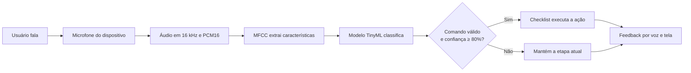

# Criação de Experiências Interativas com IoT

## VozSegura 2.0 — checklist inteligente de segurança por voz

**Unidade de Aprendizagem:** Sistemas Interativos e de Visualização  
**Professor:** Edson Moacir Ahlert  
**Estudantes:** Kauan Morinel Calheiro e Everton Luiz de Oliveira  
**Data:** 1º de setembro de 2026

## 1. Resumo da proposta

O **VozSegura 2.0** é um checklist interativo para orientar procedimentos em laboratórios e oficinas por meio de comandos de voz. A solução permite que estudantes e profissionais consultem e confirmem etapas sem tocar na tela, mantendo as mãos livres para utilizar luvas, ferramentas ou equipamentos.

O projeto dá continuidade ao conceito desenvolvido na aula anterior, na qual foi proposta uma interface de usuário por voz. Nesta nova versão, o reconhecimento de comandos foi transformado em uma aplicação de **IoT com TinyML**: o microfone atua como sensor, um modelo compacto interpreta o áudio localmente e a aplicação responde pela tela e por síntese de voz.

## 2. Problema e justificativa

Atividades práticas em laboratórios e oficinas frequentemente exigem o cumprimento de uma sequência de preparação e segurança. Durante essas tarefas, consultar uma tela pode interromper o trabalho, especialmente quando o usuário está usando luvas ou segurando ferramentas. A omissão de uma etapa também pode provocar erros, retrabalho ou acidentes.

A interação por voz foi escolhida porque permite acompanhar o procedimento sem usar as mãos. O sistema apresenta uma instrução por vez e oferece feedback imediato sobre o comando reconhecido, o progresso e a próxima ação. Dessa forma, a solução combina acessibilidade, prevenção de erros e interação não convencional.

O protótipo serve apenas como apoio ao procedimento. Ele não substitui normas institucionais, equipamentos de proteção ou supervisão responsável.

## 3. Objetivos da solução

- Permitir o acompanhamento de um checklist com as mãos livres;
- reconhecer localmente os comandos “concluído” e “repetir”;
- rejeitar outras palavras, silêncio e ruídos do ambiente;
- fornecer feedback visual e sonoro sobre cada ação;
- reduzir avanços acidentais por meio de limiar de confiança e confirmação temporal;
- demonstrar o uso de IoT, processamento de áudio e TinyML em um protótipo funcional.

## 4. Fluxo da interação

Esse fluxo corresponde à referência proposta na atividade:

> Usuário/Ambiente → Sensor ou Entrada → Processamento → Atuador ou Saída → Feedback

## 5. Sensores, entradas, atuadores e saídas

| Componente | Recurso utilizado | Função no protótipo |
|---|---|---|
| Sensor principal | Microfone do iPhone ou computador | Capturar a voz e os sons do ambiente |
| Entrada alternativa | Botões da aplicação | Garantir controle quando a voz estiver indisponível |
| Processamento | MFCC + rede neural do Edge Impulse | Extrair características do áudio e classificar o comando |
| Saída visual | Tela do navegador | Mostrar instrução, progresso, classe e confiança |
| Saída sonora | Síntese de voz do navegador | Ler a etapa e confirmar a ação |
| Armazenamento local | `localStorage` do navegador | Manter o progresso sem enviar dados a um servidor |

O smartphone funciona como um *endpoint* IoT porque reúne sensor, processamento, conectividade e saída em um único dispositivo.

## 6. Papel do TinyML

O TinyML é responsável por reconhecer um vocabulário pequeno e específico usando um modelo otimizado. Em vez de enviar continuamente o áudio para um serviço de reconhecimento de fala na nuvem, o modelo exportado pelo Edge Impulse é executado localmente por meio de WebAssembly.

O processamento possui duas etapas principais:

1. **MFCC:** transforma a onda sonora em uma representação compacta que destaca características importantes da fala;
2. **classificação:** uma rede neural calcula a probabilidade de o áudio pertencer a cada uma das quatro classes.

As classes usadas no treinamento foram:

| Classe | Comportamento esperado |
|---|---|
| `concluido` | Confirmar a etapa e avançar |
| `repetir` | Ler novamente a instrução atual |
| `desconhecido` | Rejeitar palavras que não são comandos |
| `ruido` | Rejeitar silêncio e sons do ambiente |

O processamento local oferece menor latência, maior privacidade e menor dependência da conexão. Embora o protótipo utilize um smartphone e um navegador, o mesmo fluxo pode ser exportado para dispositivos embarcados compatíveis, aproximando a solução de uma aplicação *always on*.

## 7. Plataforma e implementação

A plataforma principal escolhida foi o **Edge Impulse Studio**, utilizado para:

- coletar áudio pelo microfone do iPhone;
- organizar e dividir o conjunto de dados;
- extrair características com MFCC;
- treinar e testar a rede neural;
- realizar classificação ao vivo;
- exportar o modelo em WebAssembly.

A interface foi construída com HTML, CSS e JavaScript, sem framework externo. O pacote escolhido para implantação foi **WebAssembly (browser, SIMD)**, adequado para execução otimizada no navegador.

O protótipo está disponível na pasta [`vozsegura-2`](vozsegura-2/), com os seguintes elementos principais:

| Arquivo | Responsabilidade |
|---|---|
| [`index.html`](vozsegura-2/index.html) | Estrutura e conteúdo da interface |
| [`styles.css`](vozsegura-2/styles.css) | Apresentação responsiva para computador e celular |
| [`app.js`](vozsegura-2/app.js) | Checklist, feedback, progresso e regras de segurança |
| [`tinyml-adapter.js`](vozsegura-2/tinyml-adapter.js) | Microfone, áudio PCM16 e integração com o modelo |
| [`TESTE-MODELO.md`](vozsegura-2/TESTE-MODELO.md) | Registro detalhado dos testes |

## 8. Funcionamento do protótipo

O checklist implementado possui cinco etapas de preparação da bancada. Ao ativar os comandos de voz, o navegador solicita acesso ao microfone e começa a enviar janelas de áudio ao modelo.

Para executar uma ação, a aplicação exige:

- confiança mínima de 80%;
- duas previsões consecutivas indicando o mesmo comando;
- retorno a uma classe negativa antes de aceitar um novo comando.

Essas regras reduzem falsos positivos e impedem que uma única fala prolongada execute a ação mais de uma vez. Enquanto o VozSegura lê uma instrução, a classificação é pausada para evitar que o sistema reconheça a própria voz sintetizada.

Também foram implementados botões para voltar, concluir, repetir, cancelar e reiniciar. O progresso é salvo localmente no navegador.

## 9. Treinamento e resultados

O conjunto inicial foi criado com **1 minuto e 41 segundos de áudio**, dividido automaticamente em 80% para treinamento e 20% para teste. Foram utilizadas 52 amostras distribuídas entre as quatro classes.

### 9.1 Validação durante o treinamento

| Métrica | Resultado |
|---|---:|
| Acurácia | 60,0% |
| Loss | 0,88 |
| Área sob a curva ROC | 0,91 |
| F1 médio ponderado | 0,59 |

A validação indicou confusão principalmente entre `concluido` e `repetir`, consequência do conjunto pequeno. A classe `ruido` alcançou 100% de reconhecimento.

### 9.2 Avaliação no conjunto de teste

| Métrica | Resultado |
|---|---:|
| Acurácia | 75,86% |
| Área sob a curva ROC | 0,96 |
| Precisão média ponderada | 0,88 |
| Recall médio ponderado | 0,76 |
| F1 médio ponderado | 0,77 |

| Classe real | Concluído | Desconhecido | Repetir | Ruído | Incerto |
|---|---:|---:|---:|---:|---:|
| Concluído | 100% | 0% | 0% | 0% | 0% |
| Desconhecido | 16,7% | 58,3% | 0% | 8,3% | 16,7% |
| Repetir | 11,1% | 0% | 77,8% | 11,1% | 0% |
| Ruído | 0% | 0% | 0% | 100% | 0% |

### 9.3 Classificação ao vivo

O teste ao vivo no iPhone analisou 29 janelas ao longo de 14,5 segundos:

| Resultado | Quantidade de janelas |
|---|---:|
| `concluido` | 13 |
| `repetir` | 9 |
| `desconhecido` | 2 |
| `ruido` | 2 |
| Incerto | 3 |

Nos trechos estáveis, `concluido` apresentou confiança entre 82% e 100%, enquanto `repetir` alcançou entre 89% e 100%. As classes negativas ficaram abaixo de 80%, confirmando a utilidade do limiar escolhido para essa demonstração.

## 10. Usabilidade e prevenção de erros

O projeto preserva princípios analisados na aula anterior:

| Heurística de Nielsen | Aplicação no VozSegura 2.0 |
|---|---|
| Visibilidade do estado do sistema | A interface informa quando está pronta, ouvindo ou com erro |
| Prevenção de erros | Confiança mínima, duas previsões e bloqueio impedem avanços acidentais |
| Reconhecimento em vez de memorização | Os comandos disponíveis aparecem na interface |
| Controle e liberdade do usuário | Botões permitem voltar, cancelar e reiniciar |
| Correspondência com o mundo real | “Concluído” e “repetir” representam ações naturais do procedimento |

## 11. Limitações e melhorias futuras

O conjunto de dados ainda é pequeno, e o modelo apresenta dificuldade para rejeitar algumas palavras desconhecidas. A primeira melhoria seria coletar mais vozes, distâncias, velocidades de fala e ruídos reais de laboratórios e oficinas.

Também poderiam ser adicionados:

- comando de emergência ou cancelamento por voz;
- checklists configuráveis por responsáveis do laboratório;
- sensores ambientais, como temperatura, presença ou qualidade do ar;
- registro de data e duração de cada procedimento;
- implantação em microcontrolador com microfone e display;
- avaliação com diferentes usuários, sotaques e condições acústicas.

## 12. Evidências da plataforma e do protótipo

Para a apresentação final, devem acompanhar este relatório:

1. captura do conjunto de dados com as quatro classes no Edge Impulse;
2. captura da matriz de confusão em **Model testing**;
3. captura da **Live classification** no iPhone;
4. captura da interface do VozSegura 2.0 com o modelo carregado;
5. vídeo curto dizendo “concluído” e “repetir”, mostrando a mudança e a leitura da etapa.

> **Antes da entrega:** inserir nesta seção as capturas ou um link para o vídeo. As métricas acima foram transcritas dos testes realizados, mas o enunciado também solicita registro visual do funcionamento.

## 13. Conclusão

O VozSegura 2.0 demonstra como sensores e inteligência embarcada podem ampliar uma interface não convencional. O microfone percebe a ação do usuário, o modelo TinyML interpreta o áudio localmente e a aplicação responde por meio de tela e voz.

A evolução da proposta da aula anterior tornou o papel da inteligência artificial concreto e mensurável. Mesmo com um conjunto inicial reduzido, o modelo alcançou 75,86% no teste e reconheceu os comandos com alta confiança durante a classificação ao vivo. As regras adicionais da interface compensam parte das limitações do modelo e priorizam a prevenção de erros em um contexto relacionado à segurança.

## Referências

- Material da Aula 6. **Conceitos de IoT aplicados à Interação**. Sistemas Interativos e de Visualização, 2026.
- EDGE IMPULSE. **Keyword spotting**. Disponível em: <https://docs.edgeimpulse.com/tutorials/end-to-end/keyword-spotting>. Acesso em: 1 set. 2026.
- EDGE IMPULSE. **Mobile phone**. Disponível em: <https://docs.edgeimpulse.com/hardware/devices/mobile-phone>. Acesso em: 1 set. 2026.
- EDGE IMPULSE. **Deployment**. Disponível em: <https://docs.edgeimpulse.com/studio/projects/deployment>. Acesso em: 1 set. 2026.
- NIELSEN, Jakob. **10 Usability Heuristics for User Interface Design**. Nielsen Norman Group. Disponível em: <https://www.nngroup.com/articles/ten-usability-heuristics/>.

## Uso de inteligência artificial

A inteligência artificial generativa foi utilizada como apoio para estruturar o relatório, revisar a escrita, organizar os resultados e auxiliar na implementação da interface. O modelo de reconhecimento de comandos foi treinado com os dados coletados no Edge Impulse, e os resultados apresentados foram obtidos nos testes do próprio projeto.
